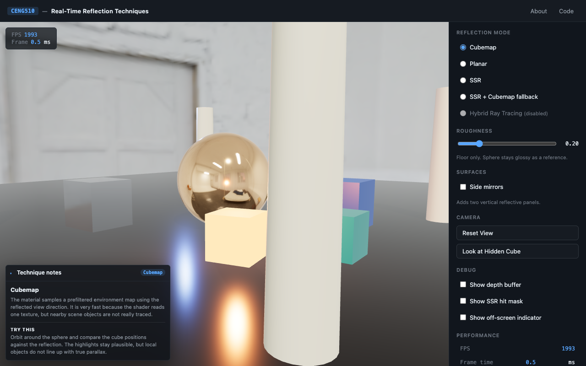
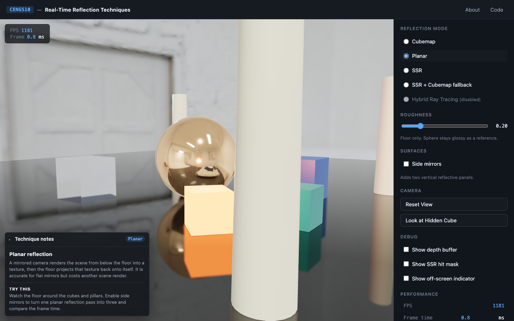
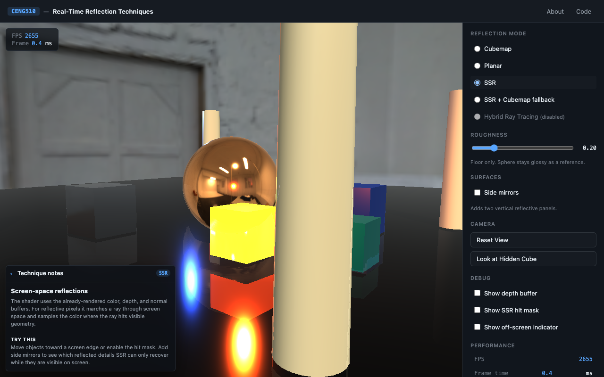
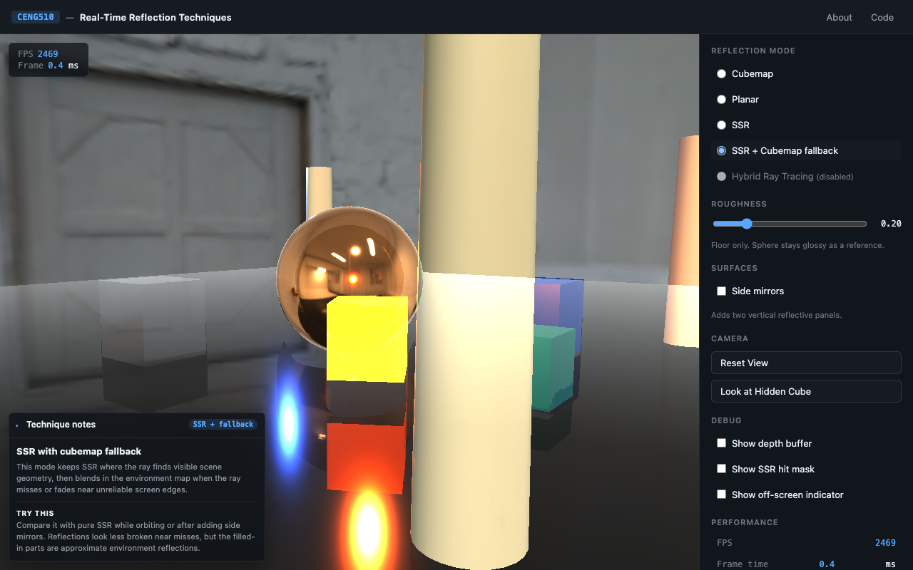
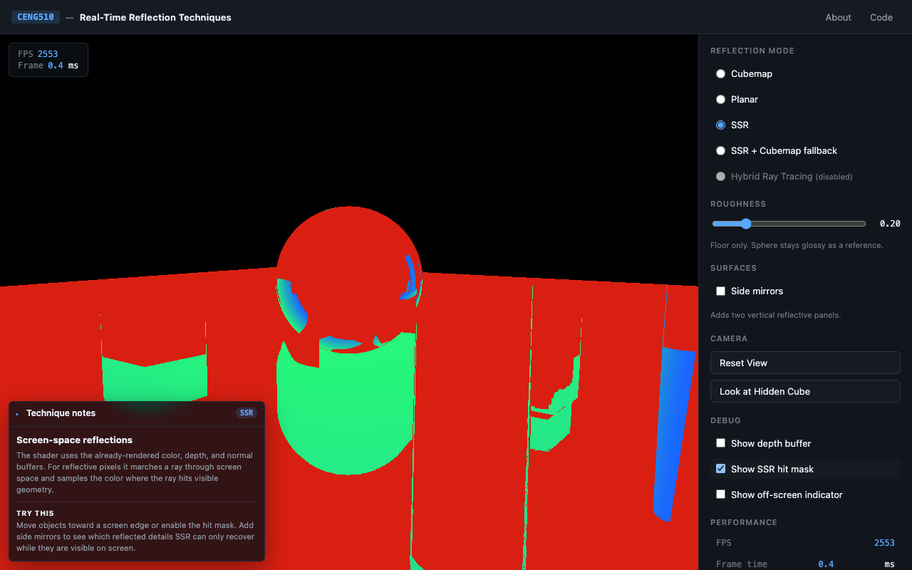
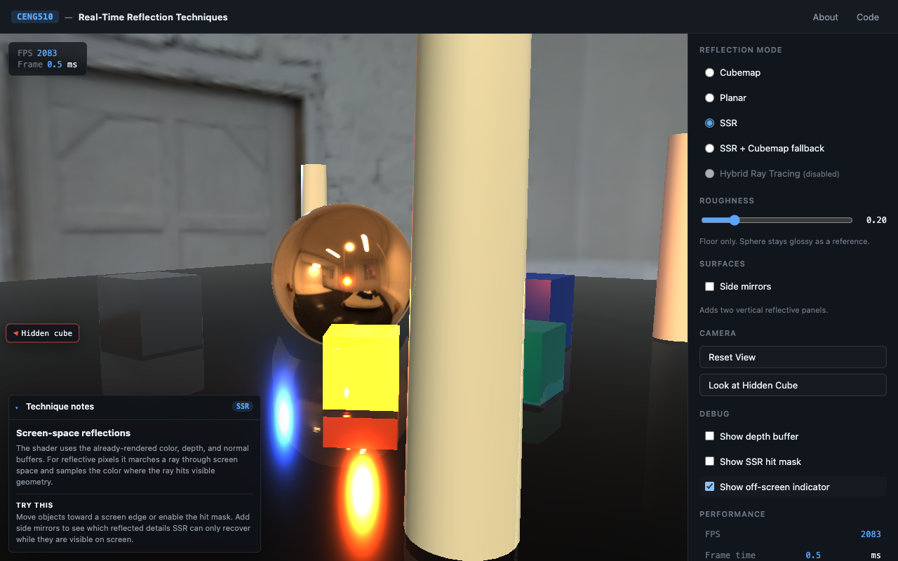
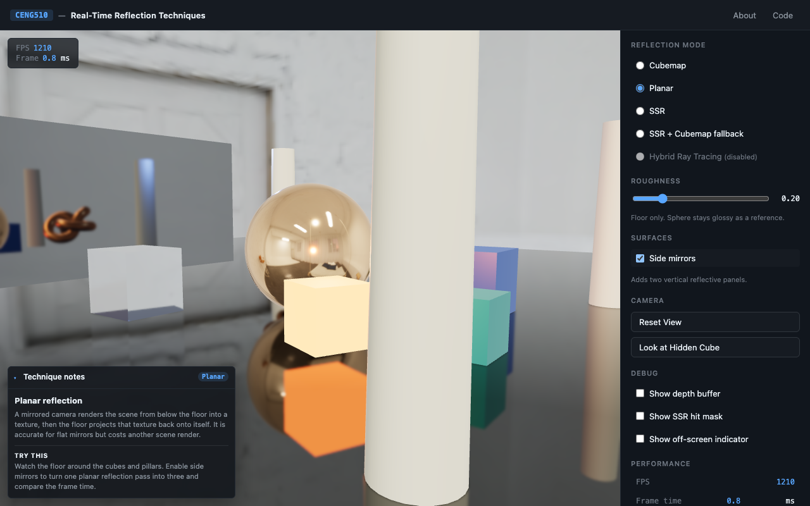

# Real-Time Reflection Techniques — Comparison Tool

> **CENG510 Final Project** — Advanced Computer Graphics, Çukurova University

An interactive web tool that demonstrates three real-time reflection techniques
on one Three.js scene: **cubemap**, **planar**, and **screen-space reflections
(SSR)**. Toggle modes, drag the roughness slider, and orbit the camera to see —
and feel — the trade-offs each technique makes. An optional side-mirror toggle
adds two more reflective surfaces in every mode; in planar mode those become
two additional planar render passes, making the cost easy to see in the FPS
overlay.

## The Story

| Year | Technique | What it fixed | New limitation |
|------|-----------|---------------|----------------|
| 1976 | **Cubemap** | Real-time reflections at all | No parallax, frozen in time |
| 1990s | **Planar** | Pixel-perfect for flat surfaces | Flat only, 2× cost per mirror |
| 2014 | **SSR** | Any shape, reuses frame data | Only on-screen content |
| 2018+ | **Hybrid RT** | Sees full 3D scene | Requires RT hardware |

The first three are implemented. Hybrid RT is shown disabled (out of scope for
WebGL).

## Running locally

No build step. Use the bundled script:

```sh
./serve.sh           # serves on http://localhost:8765
./serve.sh 8080      # custom port
```

It picks `python3` if available, falls back to `python`, then `npx serve`.

> ⚠️ Opening `index.html` directly via `file://` will fail because ES modules
> require an HTTP origin.

## Deploying to GitHub Pages

The project is a static site. The included GitHub Actions workflow packages
`index.html`, `style.css`, `src/`, `assets/`, `LICENSE`, and `README.md` into a
Pages artifact and deploys it whenever `main` is pushed.

One-time GitHub setup:

1. Create a GitHub repository and push this folder to its `main` branch.
2. In the repository, open **Settings → Pages**.
3. Set **Build and deployment → Source** to **GitHub Actions**.
4. Push to `main` or run **Deploy static site to GitHub Pages** manually from
   the Actions tab.

The deployed project URL will be shown in the workflow summary. Before final
submission, replace the top-bar `Code` link in `index.html` with the real
repository URL.

## Visual Smoke Test

Run the broad demo acceptance check before calling the implementation ready:

```sh
python3 scripts/verify_demo_acceptance.py
```

It verifies mode switching, roughness, camera buttons, debug controls, About
modal references, method notes, canvas output, SSR timing, console cleanliness,
a planar reflection alignment check, and an SSR + cubemap fallback check over
pixels that the SSR hit mask marks as misses. It also toggles the optional side
mirrors in every reflection mode and checks that they visibly affect the scene.

SSR also has a focused browser-based check that catches the "black reflective
surface" regression:

```sh
python3 scripts/verify_ssr_visual.py
```

Both checks start a temporary local server and open Chrome through Playwright.

To refresh the README/demo screenshots:

```sh
python3 scripts/capture_demo_screenshots.py
```

## Screenshots

| Cubemap | Planar |
|---------|--------|
|  |  |

| SSR | SSR + Cubemap fallback |
|-----|-------------------------|
|  |  |

| SSR hit mask | Off-screen indicator |
|--------------|----------------------|
|  |  |

| Planar with side mirrors |
|--------------------------|
|  |

## Optional HDR Environment

Drop a Poly Haven HDR into `assets/env/studio.hdr` (or `environment.hdr`) and it
will be used as the skybox + image-based lighting source. Without one the demo
falls back to a procedural environment so it still runs.

Recommended: a 2K HDR with strong directional features.
[https://polyhaven.com/hdris](https://polyhaven.com/hdris)

## Project Structure

```
.
├── index.html
├── style.css
├── scripts/
│   ├── capture_demo_screenshots.py
│   ├── verify_demo_acceptance.py
│   └── verify_ssr_visual.py
├── src/
│   ├── main.js                 # Entry, render loop, mode dispatch
│   ├── scene.js                # Scene construction + HDR loading
│   ├── ui.js                   # DOM bindings
│   ├── stats.js                # FPS / frame-time tracker
│   ├── reflections/
│   │   ├── cubemap.js
│   │   ├── planar.js
│   │   └── ssr/
│   │       ├── SSRPass.js
│   │       └── shaders.js
│   └── debug/                  # depth / ray / off-screen visualizers (Phase 5+)
└── assets/
    ├── env/                    # drop a .hdr here
    ├── screenshots/
    └── models/
```

## Status

Phase 1 (scaffold), Phase 2 (scene), and Phase 4 (planar reflections) are
complete. Cubemap and planar modes are working. SSR now renders stable
screen-space reflections over the normal PBR scene, exposes a hit/miss debug
mask, updates the SSR timing metric, has cubemap fallback mode wired, and shows
collapsible per-technique notes in the viewport. The optional side-mirror toggle
adds two vertical reflective panels across all modes; planar mode swaps those
panels for two additional true planar reflectors.
Remaining work is final packaging: push the repo, enable GitHub Pages, set the
real repository URL in the top bar, and prepare the final report material.

## References

- McGuire & Mara (2014) — *Efficient GPU Screen-Space Ray Tracing.* JCGT.
- Karis (2013) — *Real Shading in Unreal Engine 4.* SIGGRAPH course.
- Stachowiak (2015) — *Stochastic Screen-Space Reflections.* Frostbite.
- Blinn & Newell (1976) — *Texture and Reflection in Computer Generated Images.*

## License

MIT — see [LICENSE](LICENSE).
